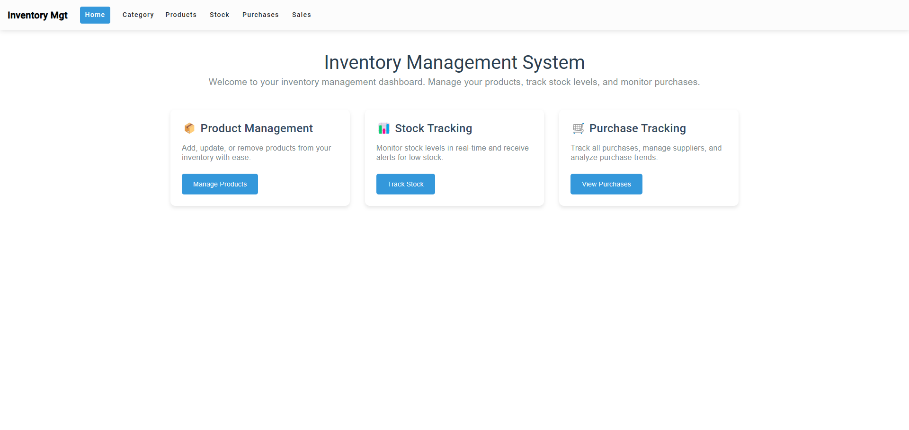

# Inventory Management System - Readme

## Project Overview
### Home page


This project is an **Inventory Management System** designed to help businesses efficiently manage their products, sales, purchases, stock levels, and categories. The system provides a user-friendly interface with advanced filtering and real-time tracking capabilities, enabling businesses to streamline their operations and improve decision-making processes.

The application is built using modern technologies, including **Angular** for the front-end, **.NET** for the back-end, and **Microsoft SQL Server** for database management. It offers a comprehensive solution for businesses looking to modernize their inventory management processes.

---

## Features

- **Product Management**: Add, update, delete, and filter products.
- **Sales Management**: Track sales transactions and analyze performance.
- **Purchase Management**: Manage purchase orders and supplier interactions.
- **Stock Management**: Monitor stock levels in real-time and receive alerts for low stock.
- **Category Management**: Organize products into categories for easier navigation.
- **User Authentication**: Secure login and role-based access control (Admin, Manager, User).
- **Advanced Filtering**: Filter products by category, price, availability, and more.

---

## Technologies Used

- **Front-End**: Angular (JavaScript library for building dynamic user interfaces).
- **Back-End**: .NET (Framework for building web applications and APIs).
- **Database**: Microsoft SQL Server (Relational database management system).
- **Version Control**: Git/GitHub (For code collaboration and version control).
- **API Testing**: Postman (For testing and documenting API endpoints).
- **Development Environment**: Visual Studio Code (Code editor with debugging and Git integration).

---

## Project Structure

The project is divided into two main components:

1. **Front-End**: Built using Angular, the front-end provides a responsive and interactive user interface.
2. **Back-End**: Built using .NET, the back-end handles business logic, API requests, and database interactions.

---

## Base Code

The base code for this project is derived from the following repository:  
[InventoryMgt_AspNetCore_Backend](https://github.com/rd003/InventoryMgt_AspNetCore_Backend.git)

We have extended and customized the original codebase to meet the specific requirements of our inventory management system, adding new features, improving the user interface, and optimizing the database structure.

---

## Installation and Setup

### Prerequisites

- **.NET SDK**: Ensure you have the .NET SDK installed.
- **Node.js**: Required for running the Angular front-end.
- **Microsoft SQL Server**: For database management.
- **Git**: For cloning the repository.

### Steps to Run the Project

1. **Clone the Repository**:
   ```bash
   git clone https://github.com/your-repo/inventory-management-system.git
   cd inventory-management-system
   ```

2. **Set Up the Database**:
   - Create a new database in Microsoft SQL Server.
   - Update the connection string in the `appsettings.json` file in the .NET project.

3. **Run the Back-End**:
   - Navigate to the back-end directory:
     ```bash
     cd dev/backend
     ```
   - Restore dependencies and run the project:
     ```bash
     dotnet restore
     dotnet run
     ```

4. **Run the Front-End**:
   - Navigate to the front-end directory:
     ```bash
     cd dev/frontend
     ```
   - Install dependencies and run the Angular application:
     ```bash
     npm install
     ng serve
     ```

5. **Access the Application**:
   - Open your browser and navigate to `http://localhost:4200` to access the application.

---

## API Documentation

The API endpoints are documented using **Postman**. You can access the full API documentation here:  
[API Documentation](https://documenter.getpostman.com/view/34697773/2sAYJ9Ae1u)

---

## Future Enhancements

- **Predictive Analytics**: Integrate machine learning models for demand forecasting.
- **Advanced Reporting**: Add detailed reporting and analytics tools.
- **Mobile Application**: Develop a mobile version of the inventory management system.
- **Automation**: Implement automated stock replenishment and purchase order generation.

---

## Contributors

- [Ayoub Majjid](https://www.linkedin.com/in/youbista/)
-  [El Hilali Aymen](https://www.linkedin.com/in/ayman-el-hilali/)
-  [Ben Yamna Salm](https://www.linkedin.com/in/salma-ben-yamna-860256250?miniProfileUrn=urn%3Ali%3Afs_miniProfile%3AACoAAD35GkgBV8Cb80zd0DdP3Jt0IgxjZJJ5Ums&lipi=urn%3Ali%3Apage%3Ad_flagship3_search_srp_people%3BXkmmuMDvQ%2F%2BWF%2BpqTqNinQ%3D%3D)


---

## Acknowledgments

We would like to express our gratitude to our supervisor, **Mme. Kawtar Imgharene**, for her guidance and support throughout the project. We also thank our families, friends, and colleagues for their encouragement and assistance.

---


For any questions or issues, please contact us at [ayoubmajid71@example.com].